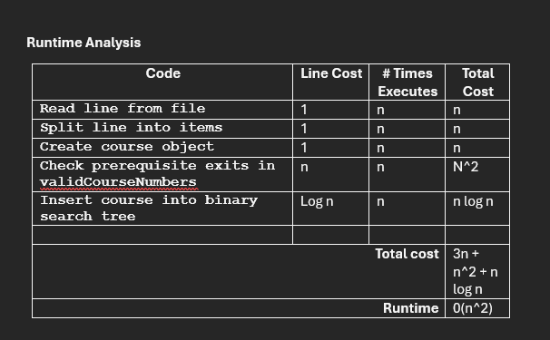

Analysis of the Data Structures



**Vector**
	A vector has a very simple implementation and would be the most user friendly of the three options. A vector would also utilize the least memory on the system. Some disadvantages would be that the linear search is much slower and would require a sacrifice in speed. The prerequisite validation is costly as well, sitting at 0(n^2). A vector is also not naturally sorted and would require sorting before printing.
  
**Hash Table**
	A hash table would have the fastest search metrics of the three options. Hash tables would also have a much quicker insertion sitting at 0(1). Some disadvantages to a hash table in this project is that it is not naturally assorted like a vector and would require sorting to be added. This method would also require another sorting method for option 2. A hash table would also require collision handling for storage.
  
**Binary Search Tree**
	A binary search tree is naturally sorted and would not require any additional steps to sort the order of contents within. A BST also has very fast searching as well as a fast course list print function. Some disadvantages to a BST would be that if the tree becomes unbalanced the big o can degrade to 0(n). Binary search trees also have a much more complicated setup. 

**Recommendation**
For this project I would recommend that a binary search tree is used to store the information. A BST is already sorted and would not require any additional steps to do so. Printing the entire course list only would require an in-order traversal with a cost of 0(n), while vectors and hash tables would require sorting first with a cost of 0(n log n). The search function in a BST is also much faster and only has a cost of 0(log n) on average. Although hash tables also have a fast search function, they would perform worse in other aspects due to needing sorting. 

**printCourseList Function**
```
void BinarySearchTree::PrintCourseList() {
    inOrder(root);
}

void BinarySearchTree::inOrder(Node* node) {
    if (node != nullptr) {
        inOrder(node->left);

        cout << node->course.courseNumber
            << ", "
            << node->course.courseTitle
            << endl;

        inOrder(node->right);
    }
}
```

**What was the problem you were solving in the projects for this course?** <br>  
The problem I was solving in the two projects was to create a course planning application that allows information to be efficiently accessed. The application needed to load course data from a CSV file and also correclty store the information in the most effecient data structure based on the requirements needed of the application. The application also needed to provide the user ability to view all of the courses as sorted with their prequisites and show the detailed information about a specfic course if needed by the user.

**How did you approach the problem? Consider why data structures are important to understand.** <br>  
I initially started by focusing on the requirements of the application and which data structure would have the best functionality for those requirements. After comparing the data structures I decided that the binary search tree, as it has the most efficient abilities for inserting data, searching data, and naturally provides sorting due to its structure. 

**How did you overcome any roadblocks you encountered while going through the activities or project?** <br>  
One of the main issues was implementing the binary search tree itself and ensuring it was done correctly. While the idea seemed simple i had issues with recrusive functions for inserting, searching, and traversing the tree. These problems were overcome by focusing on one problem at a time and conisistently going back to the book and searching more documentation to help me better understand binary search trees. Another big issue was the CSV file reading and validating the information that the file contained. At one point, I could not get the prerequisites to be stored and displayed back to the user, but after some persistence I was able to get the problem solved.

**How has your work on this project expanded your approach to designing software and developing programs?** <br>  
These projects have really hammered in the idea of "the right tool for the job". Choosing the best data structure for an application early on can make a huge difference towards managing and scaling the application later on. This has taught me to slow down and to make sure I make the most informed decision when designing data structures. Knowing the advantages and disadvantages of different data structures can make the difference in a application that runs in real time with near instant loading speed and applications that have lengthy load times that can delay the user experience.

**How has your work on this project evolved the way you write programs that are maintainable, readable, and adaptable?** <br>  
This project has changed how I approach writing programs by reinforcing the idea of a clean and organized writing process. Seperating the program into individual functions and classes rather than everything into one section of code. This ultimately makes my program much more easier to follow as well as easier to understand when reviewing for bugs and errors. This has also shown the imporatance and selecting the right data structure for a programs requirements as well as, how it can negatively impact a program when choosing the wrong one. These habits are something I can carry into the proffessional world to ensure I am writing maintainable, readable, and adaptable programs and code.

